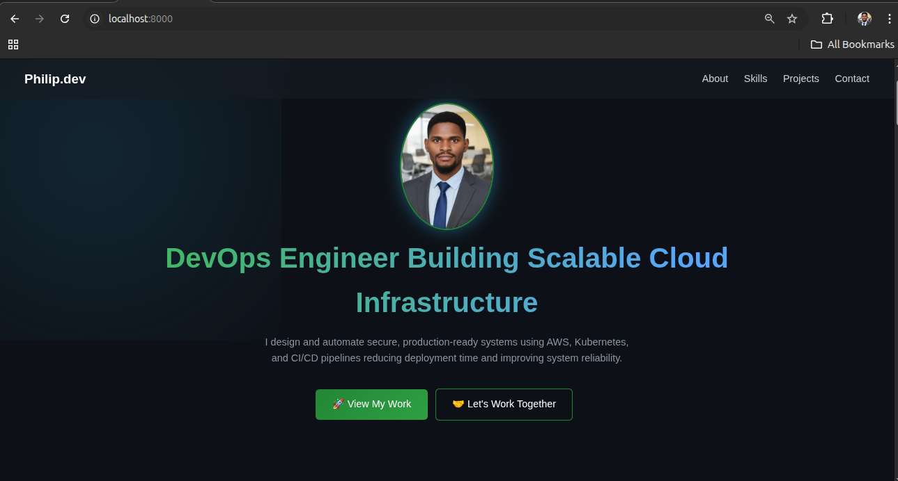

# 🚀 DevOps Portfolio Website

## 📌 Project Overview

This project is a **production-ready DevOps portfolio platform** designed to showcase real-world experience in cloud infrastructure, CI/CD automation, containerization, and Kubernetes.

Rather than a simple static website, this project demonstrates how frontend applications can be transformed into **fully automated, scalable, and cloud-native systems** using modern DevOps practices.

It reflects my ability to design, build, and deploy systems that are **reliable, reproducible, and production-focused**.

## 🧠 Architecture Overview

The system follows a modern, automated DevOps pipeline:

```
Developer → GitHub → GitHub Actions → Terraform → AWS S3 → CloudFront → End Users
```

## 🔍 Architecture Breakdown

- **Developer**
  - Writes and updates application code locally

- **GitHub (Version Control)**
  - Stores source code and manages versioning

- **GitHub Actions (CI/CD)**
  - Automates build and deployment workflows on every push

- **Terraform (Infrastructure as Code)**
  - Provisions and manages AWS resources in a consistent and repeatable way

- **AWS S3 (Static Hosting)**
  - Hosts the portfolio website as a static application

- **AWS CloudFront (CDN + HTTPS)**
  - Provides global content delivery with caching and HTTPS security

- **End Users**
  - Access the application through a fast and secure CDN-backed endpoint

## 🎯 Key Objectives

This project was built to achieve the following:

- Design a **modern and recruiter-focused portfolio interface**
- Implement **Infrastructure as Code using Terraform**
- Build a **fully automated CI/CD pipeline**
- Deploy a **secure and globally accessible web application**
- Demonstrate **real-world DevOps workflows and architecture**
- Showcase hands-on experience with **AWS cloud services**

## 🛠️ Tech Stack

### 🌐 Frontend

- HTML5
- CSS3
- JavaScript

### ☁️ Cloud & DevOps

- AWS S3 (Static Website Hosting)
- AWS CloudFront (CDN + HTTPS)
- AWS Route 53 (Custom Domain - Optional)
- Terraform (Infrastructure as Code)
- GitHub Actions (CI/CD Automation)

## 🧩 Key Features

- Fully responsive and modern UI design
- Project-focused layout showcasing DevOps work
- Automated deployment pipeline (CI/CD)
- Infrastructure fully managed with Terraform
- Secure delivery via CloudFront (HTTPS)
- Optimized for performance and scalability

## 📦 Deliverables

This project provides:

- ✅ Production-ready portfolio website
- ✅ Automated infrastructure provisioning (Terraform)
- ✅ CI/CD pipeline for continuous deployment
- ✅ AWS-hosted and CDN-distributed application
- ✅ Secure HTTPS-enabled delivery
- ✅ Comprehensive documentation

## 🧰 Tools & Technologies

| Category               | Tools / Services                    |
|----------------------|------------------------------------|
| Version Control      | Git, GitHub                        |
| Cloud Platform       | AWS                                |
| Infrastructure as Code | Terraform                        |
| CI/CD                | GitHub Actions                     |
| Containerization     | Docker *(used in related projects)*|
| Operating System     | Linux                              |
| Scripting            | Bash                               |
| Development Tools    | VS Code                            |

## 📁 Project Structure

```
Devops-Portfolio-Website/
│
├── index.html              # Application structure
├── style.css               # UI styling and layout
├── script.js               # Interactivity and animations
│
├── assets/                 # Images and project visuals
│   └── profile.jpg
│
├── terraform/              # Infrastructure as Code
│   ├── main.tf
│   ├── variables.tf
│   ├── outputs.tf
│
├── .github/
│   └── workflows/
│       └── deploy.yml      # CI/CD pipeline
│
└── README.md               # Project documentation
```

## ✅ Outcome

This project demonstrates my ability to:

- Design and deploy **cloud-native applications**
- Automate infrastructure using **Terraform**
- Build **CI/CD pipelines for continuous delivery**
- Deliver scalable and secure applications using **AWS services**

It serves as both a **technical portfolio** and a **real-world DevOps implementation**, reflecting industry best practices.

## ⚡ Task 1: Frontend Development – DevOps Portfolio Website

### 📌 Objective

The objective of this task is to design and develop a **modern, responsive, and recruiter-focused DevOps portfolio website** using core frontend technologies.

This portfolio serves as the **presentation layer of a real-world DevOps portfolio**, showcasing hands-on projects in cloud infrastructure, CI/CD automation, containerization, and Kubernetes.

It also acts as the **foundation for subsequent DevOps processes**, including cloud hosting, Infrastructure as Code (IaC), and CI/CD pipeline integration.

### 🧱 Approach

The frontend was developed using a **component-based and modular structure**, ensuring scalability, maintainability, and clean separation of concerns.

The design focuses on:

- Clean and professional UI (dark theme)
- Clear project-first storytelling for recruiters
- Structured layout highlighting real-world DevOps experience
- Lightweight and fast-loading static assets
- Consistency in design, spacing, and interaction

### 📁 Project Structure

The application follows a **minimal and production-style structure**:

```
devops-portfolio-website/
│
├── index.html        # Main structure and content
├── style.css         # Styling, layout, and responsiveness
├── script.js         # Interactivity and animations
└── assets/           # Images, project screenshots, and icons
```

### 🧩 Application Design

The portfolio is structured into clearly defined sections to improve **usability and recruiter navigation**:

#### 1. Navigation Bar

- Sticky navigation for easy access across sections
- Smooth scrolling between sections

#### 2. Hero Section

Introduces the engineer with a strong value proposition:

> DevOps Engineer | Building Scalable Cloud Infrastructure & CI/CD Systems

Includes:
- Profile image
- Call-to-action buttons (Projects & Contact)

#### 3. About Section

Provides a concise overview of professional focus:

- Cloud infrastructure design on AWS
- CI/CD pipeline automation
- Containerization and orchestration
- Production-ready system design

#### 4. Skills Section

Displays technical competencies using a **card-based grid layout**, grouped into:

- Cloud & Infrastructure (AWS, ECS, EKS, VPC, Load Balancer)
- Containers & Orchestration (Docker, Kubernetes, Helm, Kustomize)
- CI/CD & Automation (GitHub Actions, Jenkins)
- Infrastructure as Code (Terraform)
- DevSecOps (Trivy, Security Scanning)
- Systems & Scripting (Linux, Bash)

#### 5. Projects Section (Core Focus)

The most important section of the portfolio, showcasing **real-world DevOps projects**:

- Kubernetes CI/CD Platform with security scanning
- AWS ECS deployment with Terraform, Docker, and ECR
- Scalable WordPress architecture (ALB, ASG, RDS, EFS)
- GitOps workflow using Kustomize and GitHub Actions
- Jenkins + Helm CI/CD pipeline on EKS
- Personal portfolio deployment on AWS

Each project includes:
- Architecture or deployment visuals
- Technology stack
- Key results and impact
- Direct link to source code (View Code)

#### 6. Contact Section

Provides direct communication channels:

- Email
- GitHub
- LinkedIn

Encourages collaboration and job opportunities.

### 🎨 UI/UX Design Decisions

- **Dark Theme**: Modern developer-focused aesthetic with improved readability
- **Card-Based Layout**: Enhances clarity and separation of content
- **Skills Grid System**: Improves visibility of technical expertise
- **Consistent Design System**: Uniform spacing, colors, and typography
- **Responsive Design**: Optimized for desktop, tablet, and mobile devices
- **Interactive Elements**: Hover effects and smooth transitions

### ⚙️ Functionality Implemented

- Smooth scrolling navigation
- Scroll-based animations (Intersection Observer)
- Active navigation highlighting
- Image preview modal for project visuals
- Page fade-in effect for improved user experience
- Responsive layout using CSS Grid and Flexbox

### 🧪 Local Testing

To run the application locally, use a simple HTTP server:

```bash
python3 -m http.server 8000
```

Then open your browser and visit:

```bash
http://localhost:8000
```

#### 🏠 Homepage


### 🎯 Outcome

A **fully functional, production-ready DevOps portfolio website** was developed, featuring a modern, responsive, and recruiter-friendly UI. The application is well-structured for seamless deployment on cloud platforms and prepared for DevOps integration, including Infrastructure as Code (IaC) and CI/CD pipelines.

The portfolio effectively:

* Showcases real-world DevOps projects
* Clearly communicates technical expertise
* Demonstrates both frontend development and system design skills
* Serves as a deployable asset for cloud-based workflows

### 🧠 Key Learnings

* Structuring frontend applications for production environments
* Designing recruiter-focused user interfaces
* Preparing static applications for cloud deployment
* Maintaining clean separation between structure, styling, and logic

## ⚡ Task 2: Deploy Portfolio Website to AWS S3 (Static Hosting)

### 📌 Objective

The objective of this task is to deploy the portfolio website to **Amazon S3 using static website hosting**, making the application publicly accessible and transitioning it from a local environment to a **cloud-based deployment**.

This represents the first step in delivering the application in a **real-world production environment**.

### 🧠 Overview

The application is deployed as a **static web application** using AWS S3, which enables direct hosting of HTML, CSS, and JavaScript files without requiring a backend server.

This approach aligns with modern cloud practices due to:

- High availability and durability
- Cost efficiency (serverless hosting)
- Scalability without infrastructure management
- Simplicity and fast deployment

### 🏗️ Architecture (Task 2)

```
User (Browser) → AWS S3 → Static Website (HTML, CSS, JS)
```

### 🔍 Architecture Explanation

- Users access the application via a public S3 endpoint
- AWS S3 serves static assets directly
- The browser renders the UI without backend processing

### 🧱 Implementation Steps

#### 🔹 Step 1: Create S3 Bucket

Navigate to:

👉 AWS Console → S3 → **Create Bucket**

**Configuration:**

- Bucket Name:
```bash
philip-devops-portfolio
```

* Region:
  Select the nearest region (`us-east-1`)

#### 🔹 Step 2: Configure Public Access

By default, S3 blocks public access.

To allow public hosting:

* Disable:

```bash
Block all public access
```

* Acknowledge the warning

> ⚠️ Required for public static website hosting

#### 🔹 Step 3: Enable Static Website Hosting

Navigate to:

👉 **Bucket → Properties → Static Website Hosting**

Configure:

* Enable: ✅
* Index document:

```bash
index.html
```

Save changes.

#### 🔹 Step 4: Upload Application Files

Navigate to:

👉 **Objects → Upload**

Upload the application files:

```bash
index.html
style.css
script.js
assets/
```

> Ensure all assets (images) are included to prevent broken UI components.

#### 🔹 Step 5: Configure Bucket Policy

To allow public read access:

👉 **Permissions → Bucket Policy**

```json
{
  "Version": "2012-10-17",
  "Statement": [
    {
      "Sid": "PublicReadAccess",
      "Effect": "Allow",
      "Principal": "*",
      "Action": "s3:GetObject",
      "Resource": "arn:aws:s3:::philip-devops-portfolio/*"
    }
  ]
}
```

#### 🔹 Step 6: Access the Application

After enabling static hosting:

👉 Navigate to:

**Properties → Static Website Hosting**

Retrieve the endpoint URL:

```bash
http://philip-devops-portfolio.s3-website-us-east-1.amazonaws.com/
```

### 🎉 Result

The portfolio website is now:

* 🌍 Publicly accessible via the internet
* ☁️ Hosted on AWS S3
* ⚡ Served as a static web application

### 📸 Screenshots

#### 🪣 S3 Bucket Created


#### 🌐 Static Hosting Enabled


#### 🚀 Live Website


### 🎯 Outcome

At the end of this task:

* ✅ Website successfully deployed to AWS S3
* ✅ Static hosting enabled
* ✅ Public access configured
* ✅ Application accessible via URL

### 🧠 Key Concepts Demonstrated

* Static website hosting using AWS S3
* Public access configuration and bucket policies
* Cloud-based deployment of frontend applications
* Serverless hosting model

### 💡 Best Practices Applied

* Used globally unique bucket naming convention
* Maintained clean project structure for deployment
* Enabled only required public permissions
* Followed a simple and scalable hosting approach

### ⚠️ Limitations (Pre-Production Considerations)

While S3 static hosting is effective, it has limitations:

* No HTTPS by default
* No custom domain without additional services
* Limited caching control

👉 These are addressed in **Task 3 (CloudFront + Terraform)** for a production-grade setup.


