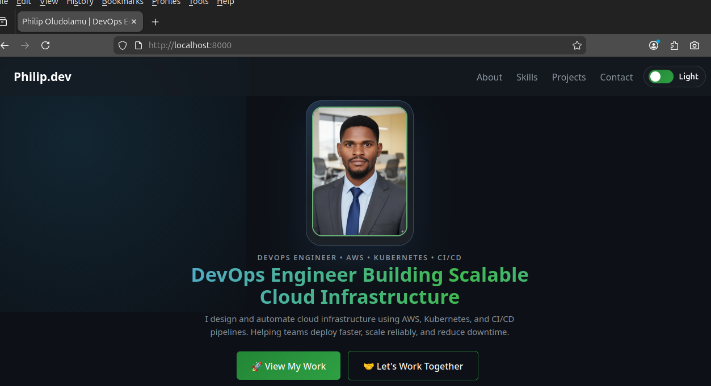
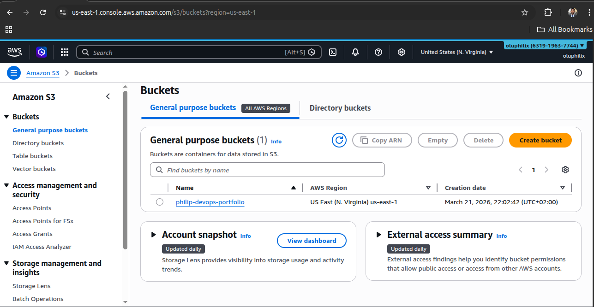
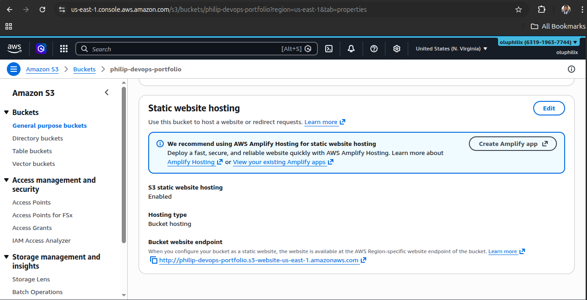
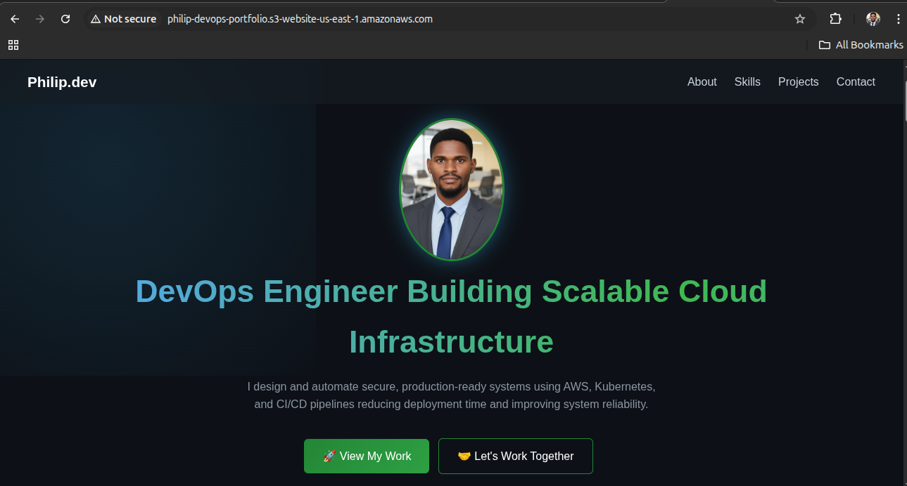
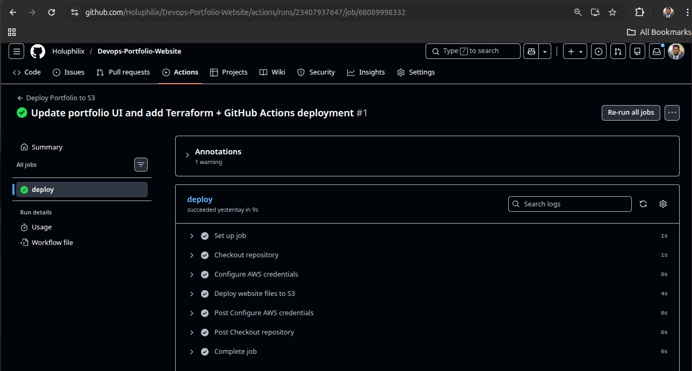
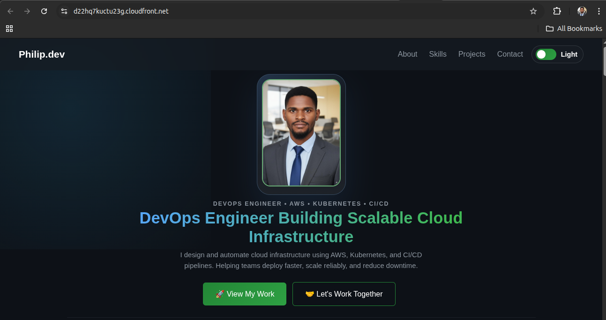
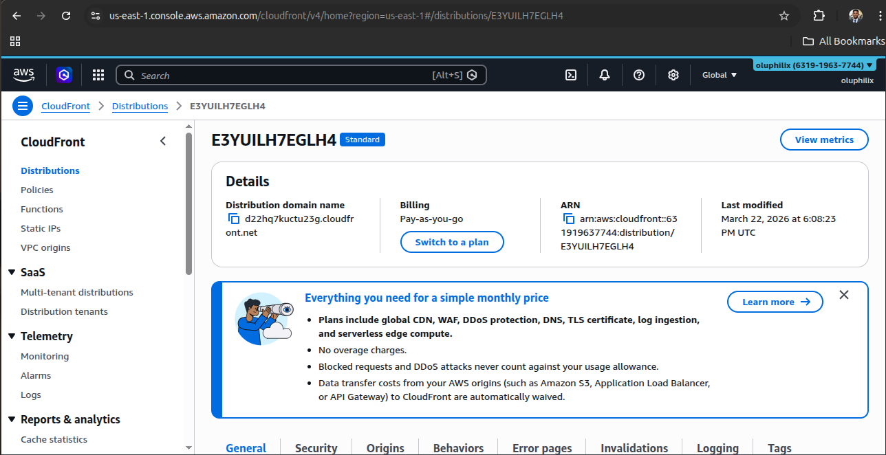
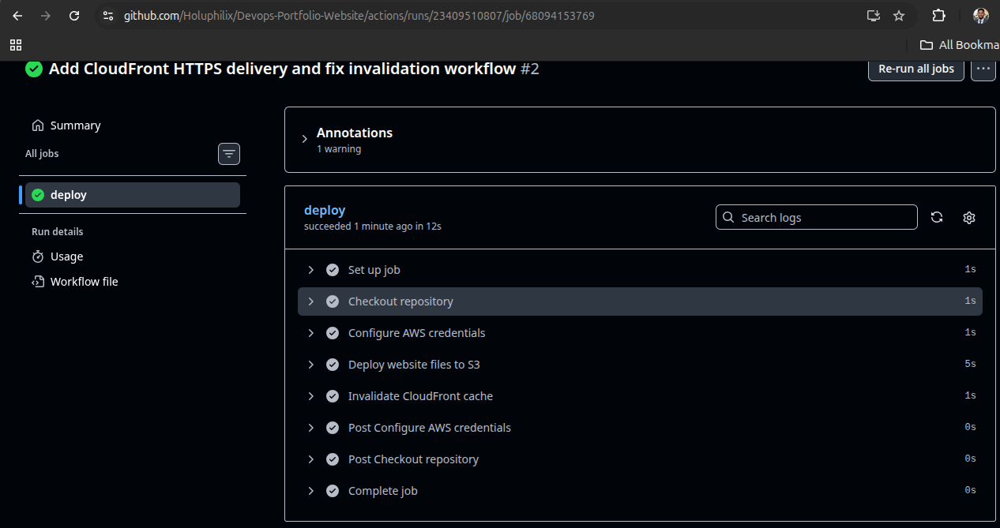

# 🚀 DevOps Portfolio Website

## 📌 Project Overview

This project is a **production-ready DevOps portfolio platform** designed to showcase real-world experience in cloud infrastructure, CI/CD automation, containerization, and Kubernetes.

Rather than a simple static website, this project demonstrates how frontend applications can be transformed into **fully automated, scalable, and cloud-native systems** using modern DevOps practices.

It reflects my ability to design, build, and deploy systems that are **reliable, reproducible, and production-focused**.

## 🧠 Architecture Overview

The project now follows a modern DevOps delivery flow:

```
Developer → GitHub → GitHub Actions → AWS S3 → CloudFront → End Users
```

Infrastructure for the hosting layer is provisioned separately using Terraform:

```bash
Terraform → AWS S3 + CloudFront
```

## 🌐 Live Endpoints

The project currently has two working public endpoints:

- **Primary HTTPS URL:** `https://d22hq7kuctu23g.cloudfront.net`
- **Direct S3 Website URL:** `http://philipdev-portfolio-website.s3-website-us-east-1.amazonaws.com/`

## 🔍 Architecture Breakdown

- **Developer**
  - Writes and updates application code locally

- **GitHub (Version Control)**
  - Stores source code and manages versioning

- **GitHub Actions (CI/CD)**
  - Automates build and deployment workflows on every push

- **Terraform (Infrastructure as Code)**
  - Provisions and manages AWS resources in a consistent and repeatable way

- **AWS S3 (Static Hosting)**
  - Hosts the portfolio website as a static application

- **AWS CloudFront (CDN + HTTPS)**
  - Provides global content delivery with caching and HTTPS security

- **End Users**
  - Access the application through a fast and secure CDN-backed endpoint

## 🎯 Key Objectives

This project was built to achieve the following:

- Design a **modern and recruiter-focused portfolio interface**
- Implement **Infrastructure as Code using Terraform**
- Build a **fully automated CI/CD pipeline**
- Deploy a **secure and globally accessible web application**
- Demonstrate **real-world DevOps workflows and architecture**
- Showcase hands-on experience with **AWS cloud services**

## 🛠️ Tech Stack

### 🌐 Frontend

- HTML5
- CSS3
- JavaScript

### ☁️ Cloud & DevOps

- AWS S3 (Static Website Hosting)
- AWS CloudFront (CDN + HTTPS)
- AWS Route 53 (Custom Domain - Optional)
- Terraform (Infrastructure as Code)
- GitHub Actions (CI/CD Automation)

## 🧩 Key Features

- Fully responsive and modern UI design
- Project-focused layout showcasing DevOps work
- Dedicated **Resume & Experience** section with downloadable PDF resume
- Project metadata highlighting **Built**, **Updated**, and **Status** details
- Automated deployment pipeline (CI/CD)
- Infrastructure fully managed with Terraform
- Secure delivery via CloudFront (HTTPS)
- Optimized for performance and scalability

## 📦 Deliverables

This project provides:

- ✅ Production-ready portfolio website
- ✅ Automated infrastructure provisioning (Terraform)
- ✅ CI/CD pipeline for continuous deployment
- ✅ AWS-hosted and CDN-distributed application
- ✅ Secure HTTPS-enabled delivery
- ✅ Comprehensive documentation

## 🧰 Tools & Technologies

| Category               | Tools / Services                    |
|----------------------|------------------------------------|
| Version Control      | Git, GitHub                        |
| Cloud Platform       | AWS                                |
| Infrastructure as Code | Terraform                        |
| CI/CD                | GitHub Actions                     |
| Containerization     | Docker *(used in related projects)*|
| Operating System     | Linux                              |
| Scripting            | Bash                               |
| Development Tools    | VS Code                            |

## 📁 Project Structure

```bash
Devops-Portfolio-Website/
├── index.html                 # Website structure and content
├── style.css                  # Styling, responsiveness, and themes
├── script.js                  # Interactivity, theme toggle, and modal logic
├── README.md                  # Project documentation
├── assets/                    # Images, project visuals, and downloadable resume PDF
├── .github/
│   └── workflows/
│       └── deploy.yml         # CI/CD deployment workflow
└── terraform/                 # Infrastructure as Code
    ├── versions.tf
    ├── main.tf
    ├── variables.tf
    ├── outputs.tf
    ├── terraform.tfvars
    └── .terraform.lock.hcl
```

## ✅ Outcome

This project demonstrates my ability to:

- Design and deploy **cloud-native applications**
- Automate infrastructure using **Terraform**
- Build **CI/CD pipelines for continuous delivery**
- Deliver scalable and secure applications using **AWS services**

It serves as both a **technical portfolio** and a **real-world DevOps implementation**, reflecting industry best practices.

## ⚡ Task 1: Frontend Development – DevOps Portfolio Website

### 📌 Objective

The objective of this task is to design and develop a **modern, responsive, and recruiter-focused DevOps portfolio website** using core frontend technologies.

This portfolio serves as the **presentation layer of a real-world DevOps portfolio**, showcasing hands-on projects in cloud infrastructure, CI/CD automation, containerization, and Kubernetes.

It also acts as the **foundation for subsequent DevOps processes**, including cloud hosting, Infrastructure as Code (IaC), and CI/CD pipeline integration.

### 🧱 Approach

The frontend was developed using a **component-based and modular structure**, ensuring scalability, maintainability, and clean separation of concerns.

The design focuses on:

- Clean and professional UI (dark theme)
- Clear project-first storytelling for recruiters
- Structured layout highlighting real-world DevOps experience
- Lightweight and fast-loading static assets
- Consistency in design, spacing, and interaction

### 📁 Project Structure

The application follows a **minimal and production-style structure**:

```
devops-portfolio-website/
│
├── index.html        # Main structure and content
├── style.css         # Styling, layout, and responsiveness
├── script.js         # Interactivity and animations
└── assets/           # Images, project screenshots, and icons
```

### 🧩 Application Design

The portfolio is structured into clearly defined sections to improve **usability and recruiter navigation**:

#### 1. Navigation Bar

- Sticky navigation for easy access across sections, including the Resume link
- Smooth scrolling between sections

#### 2. Hero Section

Introduces the engineer with a strong value proposition:

> DevOps Engineer Building Scalable Cloud Infrastructure

Includes:
- Profile image
- Call-to-action buttons (Projects, GitHub, and LinkedIn)

#### 3. About Section

Provides a concise overview of professional focus:

- Cloud infrastructure design on AWS
- CI/CD pipeline automation
- Containerization and orchestration
- Production-ready system design

#### 4. Skills Section

Displays technical competencies using a **card-based grid layout**, grouped into:

- Cloud & Infrastructure (AWS, ECS, EKS, VPC, Load Balancer)
- Containers & Orchestration (Docker, Kubernetes, Helm, Kustomize)
- CI/CD & Automation (GitHub Actions, Jenkins)
- Infrastructure as Code (Terraform)
- DevSecOps (Trivy, Security Scanning)
- Systems & Scripting (Linux, Bash)

#### 5. Projects Section (Core Focus)

The most important section of the portfolio, showcasing **real-world DevOps projects**:

- Kubernetes CI/CD Platform with security scanning
- AWS ECS deployment with Terraform, Docker, and ECR
- Scalable WordPress architecture (ALB, ASG, RDS, EFS)
- GitOps workflow using Kustomize and GitHub Actions
- Jenkins + Helm CI/CD pipeline on EKS
- Personal portfolio deployment on AWS

Each project includes:
- Architecture or deployment visuals
- Recruiter-friendly metadata such as **Built**, **Updated**, and **Status**
- Technology stack
- Key results and impact
- Direct link to source code (View Code)
- Live site link where applicable

#### 6. Resume & Experience Section

Provides a dedicated recruiter-facing CTA:

- Downloadable PDF resume
- Browser-view option for quick review
- Resume details such as file format, page count, and update month
- Recruiter-oriented call-to-action linking to the contact section

#### 7. Contact Section

Provides direct communication channels:

- Email
- GitHub
- LinkedIn

Encourages collaboration and job opportunities.

### 🎨 UI/UX Design Decisions

- **Dark Theme**: Modern developer-focused aesthetic with improved readability
- **Card-Based Layout**: Enhances clarity and separation of content
- **Skills Grid System**: Improves visibility of technical expertise
- **Consistent Design System**: Uniform spacing, colors, and typography
- **Responsive Design**: Optimized for desktop, tablet, and mobile devices
- **Interactive Elements**: Hover effects and smooth transitions

### ⚙️ Functionality Implemented

- Smooth scrolling navigation
- Resume download and browser-view CTA
- Scroll-based animations (Intersection Observer)
- Active navigation highlighting
- Theme toggle with saved user preference
- Image preview modal for project visuals
- Page fade-in effect for improved user experience
- Responsive layout using CSS Grid and Flexbox

### 🧪 Local Testing

To run the application locally, use a simple HTTP server:

```bash
python3 -m http.server 8000
```

Then open your browser and visit:

```bash
http://localhost:8000
```

If updates do not appear immediately in the browser, perform a hard refresh to clear cached static assets.

#### 🏠 Homepage


### 🎯 Outcome

A **fully functional, production-ready DevOps portfolio website** was developed, featuring a modern, responsive, and recruiter-friendly UI. The application is well-structured for seamless deployment on cloud platforms and prepared for DevOps integration, including Infrastructure as Code (IaC) and CI/CD pipelines.

The portfolio effectively:

* Showcases real-world DevOps projects
* Clearly communicates technical expertise
* Demonstrates both frontend development and system design skills
* Serves as a deployable asset for cloud-based workflows

### 🧠 Key Learnings

* Structuring frontend applications for production environments
* Designing recruiter-focused user interfaces
* Preparing static applications for cloud deployment
* Maintaining clean separation between structure, styling, and logic

## ⚡ Task 2: Deploy Portfolio Website to AWS S3 (Static Hosting)

### 📌 Objective

The objective of this task is to deploy the portfolio website to **Amazon S3 using static website hosting**, making the application publicly accessible and transitioning it from a local environment to a **cloud-based deployment**.

This represents the first step in delivering the application in a **real-world production environment**.

### 🧠 Overview

The application is deployed as a **static web application** using AWS S3, which enables direct hosting of HTML, CSS, and JavaScript files without requiring a backend server.

This approach aligns with modern cloud practices due to:

- High availability and durability
- Cost efficiency (serverless hosting)
- Scalability without infrastructure management
- Simplicity and fast deployment

### 🏗️ Architecture (Task 2)

```
User (Browser) → AWS S3 → Static Website (HTML, CSS, JS)
```

### 🔍 Architecture Explanation

- Users access the application via a public S3 endpoint
- AWS S3 serves static assets directly
- The browser renders the UI without backend processing

### 🧱 Implementation Steps

#### 🔹 Step 1: Create S3 Bucket

Navigate to:

👉 AWS Console → S3 → **Create Bucket**

**Configuration:**

- Bucket Name:
```bash
philipdev-portfolio-website
```

* Region:
  Select the nearest region (`us-east-1`)

#### 🔹 Step 2: Configure Public Access

By default, S3 blocks public access.

To allow public hosting:

* Disable:

```bash
Block all public access
```

* Acknowledge the warning

> ⚠️ Required for public static website hosting

#### 🔹 Step 3: Enable Static Website Hosting

Navigate to:

👉 **Bucket → Properties → Static Website Hosting**

Configure:

* Enable: ✅
* Index document:

```bash
index.html
```

Save changes.

#### 🔹 Step 4: Upload Application Files

Navigate to:

👉 **Objects → Upload**

Upload the application files:

```bash
index.html
style.css
script.js
assets/
```

> Ensure all assets (images) are included to prevent broken UI components.

#### 🔹 Step 5: Configure Bucket Policy

To allow public read access:

👉 **Permissions → Bucket Policy**

```json
{
  "Version": "2012-10-17",
  "Statement": [
    {
      "Sid": "PublicReadAccess",
      "Effect": "Allow",
      "Principal": "*",
      "Action": "s3:GetObject",
      "Resource": "arn:aws:s3:::philipdev-portfolio-website/*"
    }
  ]
}
```

#### 🔹 Step 6: Access the Application

After enabling static hosting:

👉 Navigate to:

**Properties → Static Website Hosting**

Retrieve the endpoint URL:

```bash
http://philipdev-portfolio-website.s3-website-us-east-1.amazonaws.com/
```

### 🎉 Result

The portfolio website is now:

* 🌍 Publicly accessible via the internet
* ☁️ Hosted on AWS S3
* ⚡ Served as a static web application

### 📸 Screenshots

#### 🪣 S3 Bucket Created



#### 🌐 Static Hosting Enabled



#### 🚀 Live Website



### 📸 Optional Extra Screenshots For Task 2

- Bucket policy configuration
- S3 Objects view showing uploaded files

### 🎯 Outcome

At the end of this task:

* ✅ Website successfully deployed to AWS S3
* ✅ Static hosting enabled
* ✅ Public access configured
* ✅ Application accessible via URL

### 🧠 Key Concepts Demonstrated

* Static website hosting using AWS S3
* Public access configuration and bucket policies
* Cloud-based deployment of frontend applications
* Serverless hosting model

### 💡 Best Practices Applied

* Used globally unique bucket naming convention
* Maintained clean project structure for deployment
* Enabled only required public permissions
* Followed a simple and scalable hosting approach

### ⚠️ Limitations (Pre-Production Considerations)

While S3 static hosting is effective, it has limitations:

* No HTTPS by default
* No custom domain without additional services
* Limited caching control

## ⚡ Task 3: Terraform (Infrastructure as Code)

### 🎯 Goal

Automate everything that was previously configured manually in AWS.

In this task, Terraform is introduced to make the deployment process:

- Repeatable
- Version-controlled
- Faster to provision
- Easier to maintain across environments

### 📌 Objective

The objective of this task is to replace the manual AWS setup from Task 2 with **Infrastructure as Code (IaC)** using Terraform.

Using Terraform, the static hosting infrastructure can be defined in code and provisioned consistently whenever needed.

### ✅ What Terraform Automates

Terraform is used to:

- Create the S3 bucket
- Configure static website hosting
- Set the bucket policy for public read access
- Make the deployment reproducible

### 🧠 Overview

Rather than creating resources manually in the AWS Console, Terraform allows the infrastructure to be described declaratively in `.tf` files.

This improves reliability because:

- the infrastructure is documented as code
- the same setup can be recreated at any time
- changes can be reviewed before deployment
- the process becomes easier to scale and maintain

### 🏗️ Architecture (Task 3)

```bash
Terraform → AWS S3 → Static Website Hosting → End Users
```

### 🔍 Architecture Explanation

- **Terraform**
  - Defines and provisions AWS infrastructure from code

- **AWS S3**
  - Stores and serves the portfolio website files

- **Static Website Hosting**
  - Exposes the bucket as a public website endpoint

- **End Users**
  - Access the deployed portfolio through the S3 website URL

### 📁 Suggested Terraform Structure

```bash
terraform/
├── main.tf
├── variables.tf
└── outputs.tf
```

### 🧱 Example Terraform Configuration

#### 🔹 `main.tf`

```hcl
provider "aws" {
  region = var.aws_region
}

resource "aws_s3_bucket" "portfolio" {
  bucket = var.bucket_name
}

resource "aws_s3_bucket_website_configuration" "portfolio_website" {
  bucket = aws_s3_bucket.portfolio.id

  index_document {
    suffix = "index.html"
  }
}

resource "aws_s3_bucket_public_access_block" "portfolio_public_access" {
  bucket = aws_s3_bucket.portfolio.id

  block_public_acls       = false
  block_public_policy     = false
  ignore_public_acls      = false
  restrict_public_buckets = false
}

data "aws_iam_policy_document" "portfolio_policy" {
  statement {
    sid    = "PublicReadAccess"
    effect = "Allow"

    principals {
      type        = "*"
      identifiers = ["*"]
    }

    actions = ["s3:GetObject"]

    resources = [
      "${aws_s3_bucket.portfolio.arn}/*"
    ]
  }
}

resource "aws_s3_bucket_policy" "portfolio_bucket_policy" {
  bucket = aws_s3_bucket.portfolio.id
  policy = data.aws_iam_policy_document.portfolio_policy.json

  depends_on = [aws_s3_bucket_public_access_block.portfolio_public_access]
}
```

#### 🔹 `variables.tf`

```hcl
variable "aws_region" {
  description = "AWS region for deployment"
  type        = string
  default     = "us-east-1"
}

variable "bucket_name" {
  description = "Unique S3 bucket name for the portfolio website"
  type        = string
  default     = "philipdev-portfolio-website"
}
```

#### 🔹 `outputs.tf`

```hcl
output "website_url" {
  description = "S3 static website endpoint"
  value       = aws_s3_bucket_website_configuration.portfolio_website.website_endpoint
}
```

### 🚀 Terraform Workflow

From the `terraform/` directory:

```bash
terraform init
terraform plan
terraform apply
```

After the infrastructure is created, Terraform will return the S3 website endpoint as an output.

### 🎉 Result

At the end of this task:

* ✅ The S3 bucket is created from code
* ✅ Static hosting is configured automatically
* ✅ Public access policy is applied through Terraform
* ✅ The infrastructure can be recreated whenever needed

### 🧠 Key Concepts Demonstrated

* Infrastructure as Code using Terraform
* AWS resource provisioning through code
* Static website hosting configuration
* Declarative infrastructure management
* Reproducible cloud deployments

### 💡 Why This Task Matters

This step marks the transition from **manual cloud configuration** to **automated infrastructure provisioning**.

It demonstrates the ability to:

* manage infrastructure professionally
* reduce configuration drift
* improve repeatability and consistency
* prepare the project for CI/CD-driven deployments

### 🔄 Improvement Over Task 2

Compared to the manual deployment in Task 2, Terraform provides:

* faster environment setup
* cleaner infrastructure tracking
* easier updates and rollback planning
* better collaboration through version-controlled infrastructure files

## ⚡ Task 4: CI/CD with GitHub Actions

### 🎯 Goal

Automate deployment on every code push.

The deployment flow now becomes:

```bash
GitHub → GitHub Actions → AWS S3
```

This removes the need to upload website files manually through the AWS Console.

### 📌 Objective

The objective of this task is to build a CI/CD pipeline using GitHub Actions that automatically deploys the portfolio website to the S3 bucket whenever changes are pushed to the repository.

### ✅ What This Task Automates

With GitHub Actions, the project now:

- Detects code pushes to the main branch
- Runs a deployment workflow automatically
- Uploads the latest website files to AWS S3
- Replaces manual file uploads completely

### 🧠 Overview

This task introduces continuous deployment for the frontend application.

Instead of:

* editing code locally
* manually uploading files to S3
* repeating the same steps every time

The workflow now handles deployment automatically after each push to `main`.

### 🏗️ Architecture (Task 4)

```bash
Developer → GitHub Repository → GitHub Actions Workflow → AWS S3 → Live Portfolio Website
```

### 🔍 Architecture Explanation

- **Developer**
  - Updates the website code locally and pushes changes to GitHub

- **GitHub Repository**
  - Stores source code and triggers the workflow on push

- **GitHub Actions**
  - Runs the deployment pipeline automatically

- **AWS S3**
  - Receives the latest static files and serves the updated website

- **Live Portfolio Website**
  - Reflects the newest deployed version

### 📁 Workflow File

The workflow is stored at:

```bash
.github/workflows/deploy.yml
```

### 🧾 GitHub Actions Workflow

```yaml
name: Deploy Portfolio to S3

on:
  push:
    branches:
      - main
  workflow_dispatch:

jobs:
  deploy:
    runs-on: ubuntu-latest

    steps:
      - name: Checkout repository
        uses: actions/checkout@v4

      - name: Configure AWS credentials
        uses: aws-actions/configure-aws-credentials@v5
        with:
          aws-access-key-id: ${{ secrets.AWS_ACCESS_KEY_ID }}
          aws-secret-access-key: ${{ secrets.AWS_SECRET_ACCESS_KEY }}
          aws-region: ${{ secrets.AWS_REGION }}
          mask-aws-account-id: true

      - name: Deploy website files to S3
        run: |
          aws s3 sync . s3://${{ secrets.S3_BUCKET_NAME }} \
            --delete \
            --exclude ".git/*" \
            --exclude ".github/*" \
            --exclude "terraform/*" \
            --exclude "README.md"
```

### 🔐 Required GitHub Repository Secrets

To make the workflow work, add these secrets in:

```bash
GitHub Repository → Settings → Secrets and variables → Actions
```

Required secrets:

- `AWS_ACCESS_KEY_ID`
- `AWS_SECRET_ACCESS_KEY`
- `AWS_REGION`
- `S3_BUCKET_NAME`

Example values:

```bash
AWS_REGION=us-east-1
S3_BUCKET_NAME=philipdev-portfolio-website
```

### 🔑 Minimum AWS Permissions

The IAM user or role used by GitHub Actions should have permissions to:

- list the target bucket
- upload objects
- update existing objects
- delete removed objects

S3 permissions scope:

```json
{
  "Version": "2012-10-17",
  "Statement": [
    {
      "Effect": "Allow",
      "Action": [
        "s3:ListBucket"
      ],
      "Resource": "arn:aws:s3:::philipdev-portfolio-website"
    },
    {
      "Effect": "Allow",
      "Action": [
        "s3:GetObject",
        "s3:PutObject",
        "s3:DeleteObject"
      ],
      "Resource": "arn:aws:s3:::philipdev-portfolio-website/*"
    }
  ]
}
```

### 🚀 Deployment Process

Once the secrets are configured:

1. Update the portfolio locally
2. Commit the changes
3. Push to the `main` branch
4. GitHub Actions runs automatically
5. Files are synced to the S3 bucket
6. The live website updates automatically

### 🎉 Result

At the end of this task:

* ✅ Deployment is automated on every push to `main`
* ✅ Website files are uploaded to S3 automatically
* ✅ Manual uploads are no longer needed
* ✅ The portfolio deployment process becomes faster and more professional

### 🧠 Key Concepts Demonstrated

* CI/CD with GitHub Actions
* Automated deployment to AWS S3
* Git-based deployment workflows
* Secret management in GitHub
* Continuous delivery for static websites

### 🔥 Why This Is Big

This is a major improvement because the project now behaves like a real deployment pipeline.

Instead of manually pushing files to AWS every time, the repository itself becomes the source of truth for deployment.

That means:

* less manual work
* fewer deployment mistakes
* faster updates
* better DevOps workflow maturity

### 📸 Recommended Screenshots For Task 4

- **Successful GitHub Actions deployment run**


- **S3 bucket objects after automated deployment**


## ⚡ Task 5: CloudFront + HTTPS

### 🎯 Goal

Move the portfolio from direct S3 hosting to a more production-grade delivery layer using CloudFront.

The deployment flow now becomes:

```bash
User → CloudFront → AWS S3 Static Website
```

For now, the project uses the default CloudFront domain and HTTPS. A custom domain can be added later when ready.

### 📌 Objective

The objective of this task is to place CloudFront in front of the S3-hosted website so the portfolio can be delivered through:

- HTTPS
- better global performance
- CDN caching
- a more professional public endpoint

### ✅ What This Task Adds

With Task 5, the project now includes:

- a CloudFront distribution created with Terraform
- HTTPS through the default CloudFront certificate
- redirect from HTTP to HTTPS at the viewer layer
- CloudFront outputs for the live CDN URL
- optional cache invalidation in GitHub Actions after deployment

### 🧠 Overview

S3 static website hosting is enough to get a site online, but it is not the best final delivery layer for a production-style portfolio.

CloudFront improves the project by:

- serving the site over HTTPS
- caching content closer to users
- reducing direct dependence on the raw S3 website endpoint
- making the architecture closer to real-world cloud delivery patterns

### 🏗️ Architecture (Task 5)

```bash
User Browser → CloudFront (HTTPS) → AWS S3 Website Endpoint
```

### 🔍 Architecture Explanation

- **CloudFront**
  - Delivers the website globally with caching and HTTPS

- **AWS S3 Website Endpoint**
  - Continues to serve the static frontend files as the origin

- **End Users**
  - Access the website through the default CloudFront domain

### 📁 Terraform Resources Added

Task 5 extends the Terraform configuration with:

- `aws_cloudfront_distribution`
- `aws_cloudfront_cache_policy` data source
- CloudFront outputs for distribution ID, domain name, and HTTPS URL

### 🧱 Terraform Implementation

The CloudFront distribution is configured to:

- use the S3 website endpoint as a custom origin
- redirect viewers to HTTPS
- use the default CloudFront certificate
- cache static content using the managed caching policy
- expose a default CloudFront domain such as:

```bash
https://dxxxxxxxxxxxx.cloudfront.net
```

### 🔐 No Custom Domain Yet

This implementation does **not** require buying a domain yet.

For now, the website can be accessed using the default CloudFront domain generated by AWS.

This is the current production-style HTTPS access pattern for the project until a custom domain is connected later.

### 🌐 Current HTTPS Access

For now, the portfolio can be shared using the CloudFront domain, for example:

```bash
https://d22hq7kuctu23g.cloudfront.net
```


This is a valid live HTTPS URL, even though it is not yet branded with a custom domain.

Later, when a custom domain is available, you can extend this setup with:

- ACM certificate for your domain
- Route 53 DNS records
- CloudFront aliases

### 🚀 Terraform Workflow

From the `terraform/` directory:

```bash
terraform plan
terraform apply
```

CloudFront distributions usually take several minutes to deploy fully after `apply`.

### 📤 New Terraform Outputs

After deployment, Terraform will return:

- `cloudfront_distribution_id`
- `cloudfront_domain_name`
- `cloudfront_url`

The most important output for now is:

```bash
cloudfront_url
```

That becomes your new HTTPS live site URL.

### 🔁 GitHub Actions Update

The GitHub Actions workflow is extended to support optional CloudFront cache invalidation after each deployment.

That means when new files are uploaded to S3, CloudFront can be told to refresh cached content immediately.

### 🔐 Additional GitHub Secret For Task 5

To enable automatic invalidation after deployment, add this extra secret to your GitHub repository:

- `CLOUDFRONT_DISTRIBUTION_ID`

You can get the value from Terraform output after applying Task 5.

### 🔑 Additional AWS Permission Needed

To support CloudFront invalidation from GitHub Actions, add this AWS permission for the same deployment identity:

```json
{
  "Effect": "Allow",
  "Action": [
    "cloudfront:CreateInvalidation"
  ],
  "Resource": "*"
}
```

### 🎉 Result

At the end of this task:

* ✅ The portfolio is available through CloudFront
* ✅ The site can be accessed over HTTPS
* ✅ Global delivery and caching are enabled
* ✅ GitHub Actions can invalidate CloudFront after deployments
* ✅ The project becomes more production-grade without needing a custom domain yet

### 🧠 Key Concepts Demonstrated

* CDN delivery with CloudFront
* HTTPS for static websites
* Terraform-based CloudFront provisioning
* Cache invalidation in CI/CD
* Progressive evolution from simple hosting to production-style architecture

### 🔥 Why Task 5 Matters

This is the step that makes the portfolio feel much more like a real production deployment.

Before Task 5:

* the site is live
* but it depends directly on S3
* and only uses the raw website endpoint

After Task 5:

* the site is fronted by a CDN
* it is served over HTTPS
* updates can propagate more cleanly
* the architecture looks stronger to recruiters and hiring managers

### 📸 Recommended Screenshots For Task 5

- **CloudFront distribution details in the AWS Console**


- **Successful GitHub Actions run after CloudFront invalidation**


- **Live website opened through the HTTPS CloudFront URL**


## 👤 Author

**Philip Oludolamu**  
DevOps Engineer focused on cloud infrastructure, CI/CD automation, containerization, and Kubernetes.

- Email: `oluphilix@gmail.com`
- GitHub: [Holuphilix](https://github.com/Holuphilix)
- LinkedIn: [Philip Oludolamu](https://www.linkedin.com/in/philip-oludolamu)
